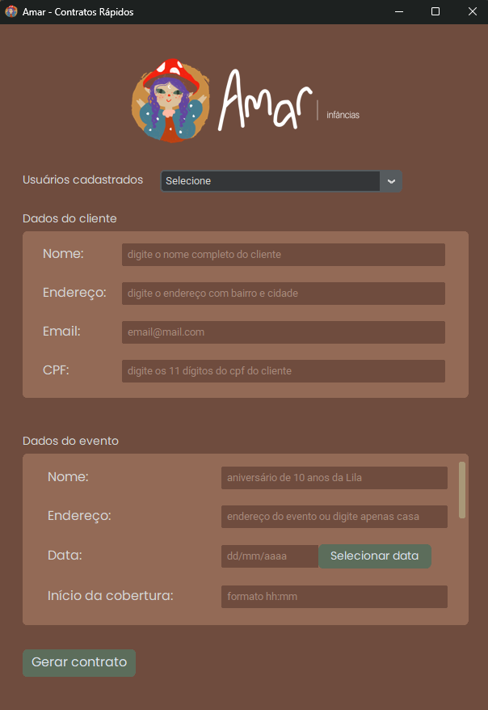
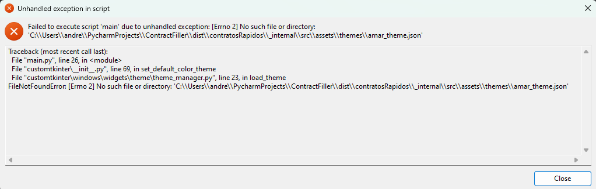

<p align="center">
  
</p>

  <p align="center">Python-based GUI application designed to streamline the generation and management of contracts for Amar Infâncias, a photography company.</p>
    <p align="center">

<div align="center">


</div>

<br>
<br>

<div align="center">



</div>

## 🎯 Goal
At <strong>Amar Infâncias</strong>, the demand for photography coverages is high, which means contracts need to be generated frequently. I saw this as a great opportunity to practice automation while developing a tool that truly enhances Amar Infâncias' daily workflow.

<hr>

## ⚙️ Technologies
The GUI app was built with:

- <strong>Python
- Python-docx
- Tkinter/Customtkinter
- SQLAlchemy
- Alembic</strong>

<hr>

## 💾 How to install
in the terminal, run the following command: 
```bash
pip install -r requirements.txt
```
if you wish to run the app from the terminal run:
```bash
python main.py
```
to generate GUI app run:

<strong>on windows</strong>
```bash
pyinstaller --name contratosRapidos --onedir --windowed --icon=src\assets\favicon.ico --add-data ".env;." main.py
```
<strong>other systems</strong>
```bash
pyinstaller --name contratosRapidos --onedir --windowed --icon=src\assets\favicon.ico --add-data ".env:." main.py
```
## ⚠️ Important
after generating the GUI app if you see an error similar to this one


just copy the src folder and paste it inside the _internal folder in dist. This error happens because the GUI application is not able to find the custom theme file for customtkinter